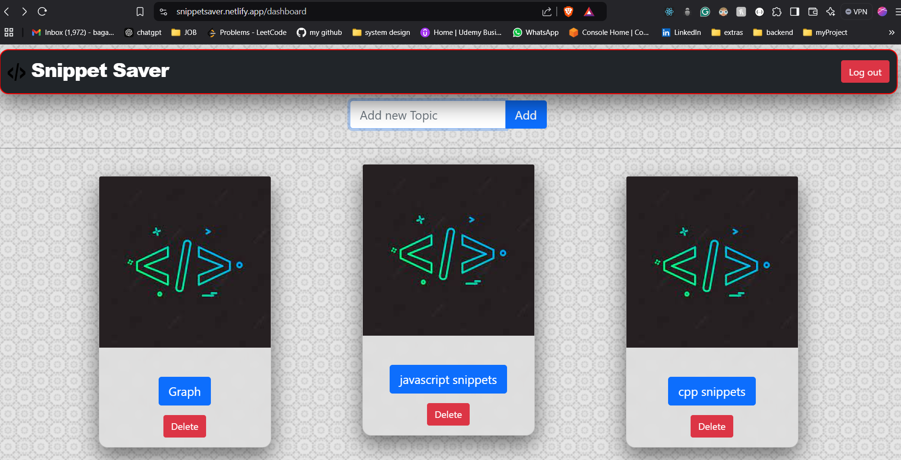
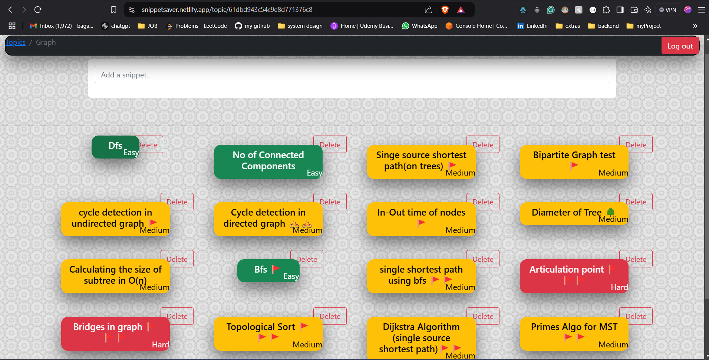

# Snippet Saver

A web application that allows users to save and execute code snippets online with ease.

## Key Features

- **Fully Functional Code Editor**: Write, edit, and execute code snippets directly in the browser.
  - **Language Support**: Supports C, C++, Java, and JavaScript.
- **OTP-based Login**: Ensures secure access for users via one-time passwords.
- **Code Snippet Management**: Save, manage, and organize your code templates effortlessly.
- **User Authentication**: Powered by Google APIs for Gmail authentication.

## Tech Stack

- **Frontend**: React.js, React-Bootstrap, Material-UI
- **Backend**: Node.js, Express.js
- **Database**: MongoDB
- **Authentication**: Firebase, Google API for Gmail authentication

---

## Usage Instructions

Follow these steps to use the Code Snippet Manager & Executor:

1. **Sign Up/Login**:

   - Use the OTP-based login system to create an account or log in securely.
   - Authenticate with your Gmail account using Google APIs.

2. **Create a Snippet**:

   - Open the code editor from the dashboard.
   - Select the programming language (C, C++, Java, or JavaScript) from the editor menu.
   - Write or paste your code in the editor.

3. **Execute the Code**:

   - Click the "Run" button to execute the code snippet.
   - View the output directly in the browser.

4. **Save Your Snippets**:

   - Save your code snippets for future use.
   - Manage and organize snippets in your personal dashboard.

5. **Edit/Delete Snippets**:

   - Modify existing code snippets or delete unwanted ones directly from your dashboard.

6. **Logout**:
   - Safely log out of your account when done.

---

## Demo

### Saving and runing a template

### view of template

### Dashboard

### All snippets of a particular topic

